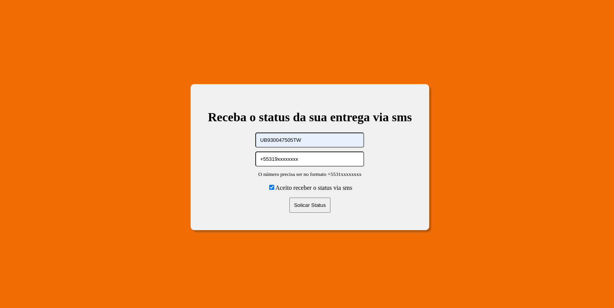

# TrackOrder SMS

TrackOrder SMS é uma web page para rastrear e monitorar encomendas. O sistema informa a cada 1 Hora caso ocorra uma atualização na encomenda.

## Funcionalidades

- Coleta dados sobre a encomenda pelo código de rasteio
- Envia a cada 1 hora uma messagem com status da encomenda caso ocorra uma atualização da encomenda ate que a encomenda seja recebida.

## Tecnologias Utilizadas

- Python
- Framework Flask
- TWILIO API
- Web Crawler
- CSS
- HTML
